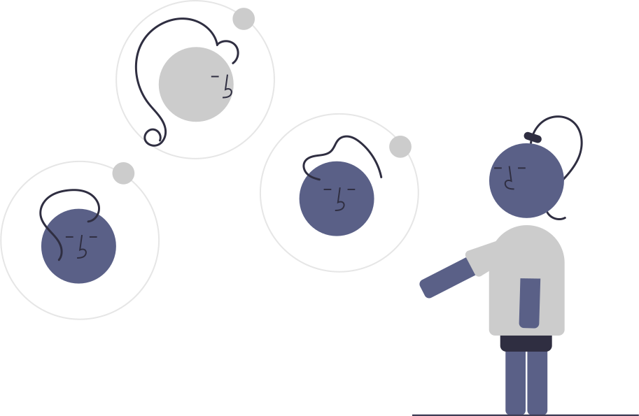

<!-- PROJECT LOGO -->
 

    

  <h1 align="center">Thalamus</h1>

  

    The Brain Behind Sustainable AI
     
    <a href="https://ballot.hackmit.org/project/potjl-vinac-wzepq-pkcfj"><strong>Ballot »</strong></a>
     
     
    <a href="https://www.linkedin.com/in/audrey-chen-tech/">Audrey Chen</a>
    ·
    <a href="https://www.linkedin.com/in/2023cyang/">Cindy Yang</a>
    ·
    <a href="https://www.linkedin.com/in/rohankalahasty/">Rohan Kalahasty</a>
    ·
    <a href="https://www.linkedin.com/in/siddhantsood1/">Siddhant Sood</a>
  

<!-- ABOUT THE PROJECT -->
## Introduction

Video Demo: https://youtu.be/mjJ8PK2FnFQ
Live App: https://thalamus-og-live.vercel.app/

The deployment of large language models (LLMs) has significantly advanced natural language processing applications. However, the high computational costs associated with running these models—both economically and environmentally—pose substantial challenges. Specifically:

* **Environmental Impact**: Millions of tons of CO₂ are emitted due to the energy-intensive inference processes of powerful LLMs.

* **Economic Costs**: Billions of dollars are wasted on processing simple queries with unnecessarily large models.

Traditional LLM routers attempt to mitigate these issues by directing simple queries to lightweight models. While this approach reduces costs and carbon footprint, it often results in decreased performance and user satisfaction.

## How Thalamus Works

Thalamus revolutionizes LLM routing by introducing a sophisticated lightweight layer that intelligently designs multi-agent systems in real-time to handle queries efficiently without compromising performance.

### Step 1: Model Fine-Tuning with QLoRA

- **Dataset Preparation**: Utilized a subset of data from the LMSYS Arena, focusing on information relevant to our models.
- **Training Objective**: Fine-tuned the model using QLoRA (Quantized Low-Rank Adaptation) to predict the most suitable LLM for a given prompt.
- **Outcome**: Enabled Thalamus to learn the mapping between different embedding clusters and the preferred LLMs for those clusters, enhancing its decision-making capability.

### Step 2: Standardized Router Output

- **Challenge**: The desired router output was too complex for existing lightweight models like Phi-3-mini to handle directly.
- **Solution**: Created a comprehensive dataset of 1,000 query-output pairs generated using GPT-4o, a robust out-of-the-box router.
- **Fine-Tuning**: Trained Phi-3-mini on this dataset using negative log-likelihood loss to ensure accurate and reliable routing decisions.
- **Optimization**: Applied 4-bit quantization to compress the model, making it lightweight enough to run directly in the browser without sacrificing performance.

### Step 3: Modeling and Evaluation
- **Human Eval Performance**: Assessed the ability of Thalamus to maintain high performance relative to larger models.
- **Cost Efficiency**: Measured the reduction in financial expenditure by using Thalamus compared to larger LLMs.
- **Carbon Footprint**: Evaluated the decrease in CO₂ emissions resulting from Thalamus’s optimized routing.

## Performance Results:

- Relative to GPT-4o:
    - Cost: 73.10% decrease
    - Performance: 0.90% increase
    - Carbon Footprint: 65.38% decrease
- Relative to Claude:
    - Cost: 68.30% decrease
    - Performance: 1.21% decrease
    - Carbon Footprint: 50.41% decrease

The carbon footprint was loosely modeled via the approach from this paper: https://openreview.net/forum?id=aIok3ZD9to 

These results demonstrate that Thalamus significantly reduces costs and environmental impact while maintaining, and in some cases even enhancing, performance.

## User Experience and Visualization

Thalamus is seamlessly integrated into standard LLM chatbot interfaces, providing users with an intuitive experience. 

Additionally, it offers:
- **Decision Visualization**: Displays insights into Thalamus’s decision-making process, helping users understand which model is being selected and why.
- **Multi-Agent Interaction**: Showcases the dynamic performance and interaction of multiple agents in real-time, enhancing transparency and trust in the system.

## Conclusion

Thalamus presents an LLM layer that allows companies to save millions while simultaneously saving environmental sustainability. By intelligently directing queries to the most appropriate model and leveraging lightweight architectures, Thalamus ensures efficient and effective language processing suitable for a wide range of applications.

(<a href="#readme-top">back to top</a>)

